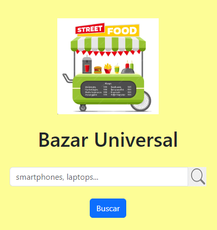

## **BazarUniversal4.0 - BackEnd**

En esta aplicación web los usuarios podrán buscar el nombre del producto, se mostrará una lista de productos como resultado y podrán hacer clic en cada uno para ver el detalle.

Los datos se obtienen de una base de datos MongoDB y se gestionan mediante Mongoose.

**Tecnologías usadas**

- **JavaScript**
- **Node**
- **Express**
- **Mongoose**
- **MongoDB**
